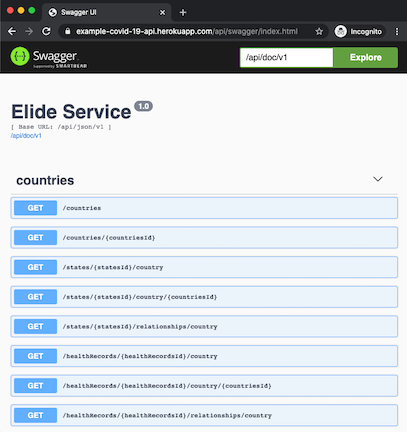
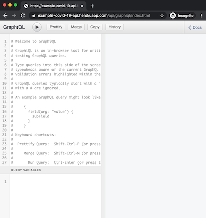

# Yahoo Knowledge COVID-19 API

The Yahoo Knowledge COVID-19 API provides [JSON-API](https://jsonapi.org/) and [GraphQL](https://graphql.org/) interfaces to access COVID-19 [public data](https://github.com/yahoo/covid-19-data/blob/master/data-sources.md) sourced and consolidated by the Yahoo Knowledge Graph Team. Raw data is available [here](https://github.com/yahoo/covid-19-data).

This API powers a sample [dashbboard](https://yahoo.github.io/covid-19-dashboard) to visualize the spread of COVID-19. The source code for the visualization is available [here](https://github.com/yahoo/covid-19-dashboard).

The API is powered by [Elide.io](https://elide.io) - an open source framework for building model driven APIs in JSON-API and GraphQL.  

## Getting Started

The API to power the dashboard is publicly hosted by Verizon Media, but is restricted to only the query shapes needed by the dashboard. 

The Application landing page supports both [Swagger](https://swagger.io/) documentation and the [GraphiQL](https://github.com/graphql/graphiql) IDE to get familiar with the APIs.
The default landing page is `/api/index.html` which can switch between Swagger and GraphiQL. Specific endpoints for Swagger and GraphiQL can be found at `/api/swagger/index.html` and `/api/graphiql/index.html` respectively.

 

## Data Model

The data model is evolving as more data becomes available worldwide.  The current model includes pre-aggregated health record data broken out by geography.  `LatestHealthRecords` is a snapshot of the latest records available for the current day.  `HealthRecords` includes records dated by publication date (there can be gaps if data was unavailable).  
`Place` represents a geographical region in the map. `Place` has many to many relationships with itself to enable parent-child hierarchy. This allows Cities to have multiple Zip Codes (multiple parents in the hierarchy).


## Install Locally

To build and run:

1. mvn clean install
2. java -jar webservice/target/covid-19-api.jar
3. Open http://localhost:8080/api

The server is available on localhost:8080.

Logs will be written to /tmp/log/covid-19-api/access.log and /tmp/log/covid-19-api/server.log.

## Usage

Both JSON-API and GraphQL APIs support:
1. Complex filtering predicates
2. Sorting by model attributes
3. Pagination and page totals
4. Compound/complex model retrieval in a single payload.

### Limitations

Collection retrieval is capped at 3,000 records per request.  By default (with no pagination parameters defined), retrieval is set to 50 records per request.

### Example JSON-API Request

To get familiar with JSON-API, check out [jsonapi.org](https://jsonapi.org/) and [Elide documentation on JSON-API](https://elide.io/pages/guide/10-jsonapi.html).

Here is an example request with filtering, sorting, and pagination:
```curl
curl "localhost:8080/api/json/v1/healthRecords?filter=totalDeaths=gt=0&sort=-totalDeaths&page[totals]&page[number]=1&page[size]=1"
```

Here is the server response:
```json
{
    "data": [
        {
            "attributes": {
                "numActiveCases": 0,
                "numDeaths": 0,
                "numPendingTests": 0,
                "numRecoveredCases": 0,
                "numTested": 0,
                "referenceDate": "2020-03-31T00:00Z",
                "totalConfirmedCases": 188172,
                "totalDeaths": 3873,
                "totalRecoveredCases": 0,
                "totalTestedCases": 0
            },
            "id": "6aa1fc99-a988-33f5-93ac-1d8fc859dc8d",
            "relationships": {
                "country": {
                    "data": {
                        "id": "09d4bca31e2fd8b0f57f79f85ed42bd8",
                        "type": "countries"
                    }
                },
                "county": {
                    "data": null
                },
                "state": {
                    "data": null
                }
            },
            "type": "healthRecords"
        }
    ],
    "meta": {
        "page": {
            "limit": 1,
            "number": 1,
            "totalPages": 2,
            "totalRecords": 2
        }
    }
}

```

### Example GraphQL Request

The GraphQL API semantics are documented in detail in [here](https://elide.io/pages/guide/11-graphql.html).  Elide accepts GraphQL queries embedded in HTTP POST requests.  It follows the convention defined by GraphQL for serving over HTTP. Namely, ever GraphQL query is wrapped in a JSON envelope object with one required attribute (query):

```curl
  curl -g -X POST -H"Content-Type: application/json" -H"Accept: application/json" \
      "http://localhost:8080/api/graphql/v1" \
      -d'{   
             "query" : "{ healthRecords(filter: \"totalDeaths=gt=0\", sort: \"-totalDeaths\", first: \"1\", after: \"0\") { pageInfo { totalRecords }, edges { node { id totalDeaths }}}}"

         }'
```

Here is the same payload for easier reading including filtering, sorting, and pagination:
```graphql
{ 
  healthRecords(filter: "totalDeaths=gt=0", sort: "-totalDeaths", first: "1", after: "0") 
  { 
    pageInfo 
    {
      totalRecords 
    }, 
    edges 
    { 
      node
      { 
        id 
        totalDeaths
      }
    }
  }
}
```

The server returns the following response:
```json
{
  "data": {
    "healthRecords": {
      "pageInfo": {
        "totalRecords": 2
      },
      "edges": [
        {
          "node": {
            "id": "6aa1fc99-a988-33f5-93ac-1d8fc859dc8d",
            "totalDeaths": 3873
          }
        }
      ]
    }
  }
}

```

## Design

The API repo is broken into three sub-modules:
1. **db-builder** - A command line utility that downloads the covid-19 data from public github and produces a [H2](https://www.h2database.com/html/main.html) database snapshot.
2. **db** - A resource only jar that packages the latest H2 database shapshot of the covid-19 data.
3. **webservice** - An elide web service that ships with the db resource only jar.

The elide web service is a shared-nothing, read-only, scalable architecture where each instance of the service is packaged with a snapshot of the latest covid-19 data.  Because the API is unauthenticated, the surface of the API is heavily restricted to support the dashboard/visualization.  This is done by disabling GraphQL endpoints and restricting the shapes of the JSON-API requests that are allowed in production.

## Maintainers
* [Jon Kilroy](https://www.linkedin.com/in/jon-kilroy-52545b4/)
* [Aaron Klish](https://www.linkedin.com/in/aaron-klish-005927/)

Please contact yk-covid-19-os@verizonmedia.com with any questions.

## Contribute
Please refer to [the contributing.md file](CONTRIBUTING.md) for information about how to get involved. We welcome issues, questions, and pull requests.

## License
This project is licensed under the terms of the [Apache 2.0](http://www.apache.org/licenses/LICENSE-2.0.html) open source license.
Please refer to [LICENSE](LICENSE) for the full terms.
